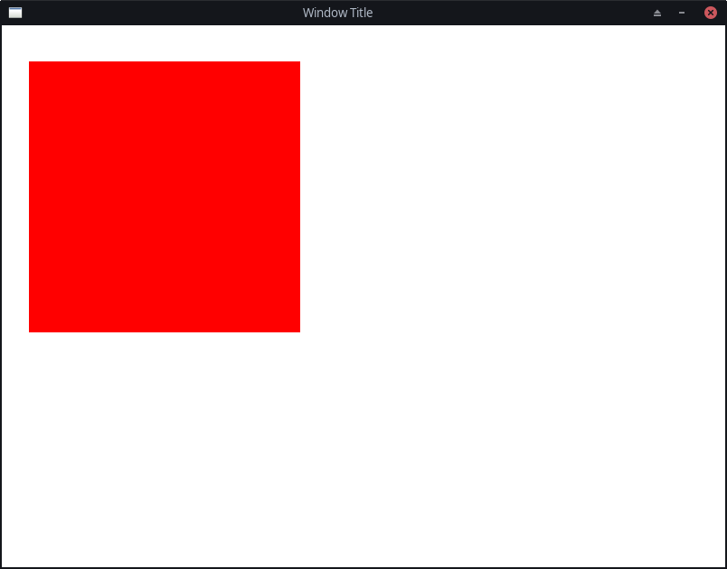
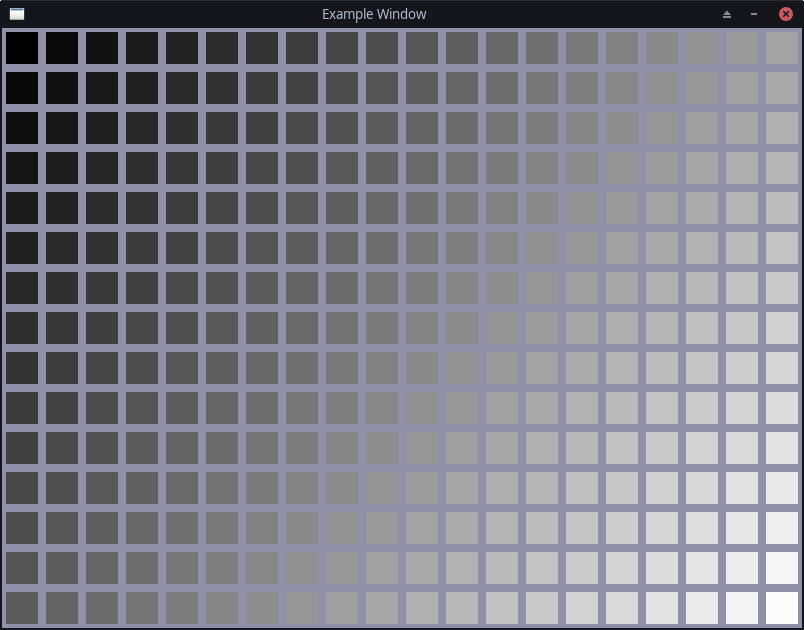

# About project
Bagiel is a simple framework used for creating simple 2D games in C++, very similar to SFML.
Currently it can:
- create window;
- handle mouse and keyboard inputs;
- draw simple color rectangles using batch rendering.

Unfortunately, documentation is not available right now, so the best method to check capabilities is just reading source code. Sorry :(

# Building
Project is written using CMake, so only dependencies used are CMake itself and Git.
```bash
mkdir build && cd build
cmake ..
make
```

# Example
```C++
#include "Window.hpp"
#include "Input.hpp"

int main() {
    bgl::Window window{ 800, 600, "Window Title" };

    bgl::Rectangle rect{ bgl::Vector2(300.f, 300.f) };
    rect.setFillColor(bgl::Color::Red);
    rect.setPosition(bgl::Vector2(30.f, 40.f));

    while (window.isOpen()) {
        if (bgl::Input::isKeyPressed(GLFW_KEY_ESCAPE)) {
            window.close();
        }

        window.clear(bgl::Color::White);

        window.draw(rect);

        window.display();
    }

    return 0;
}
```




